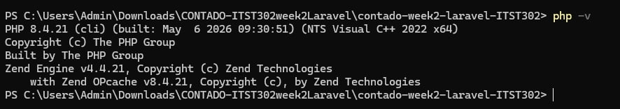
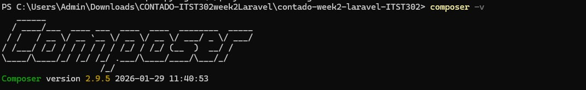
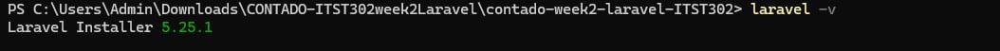
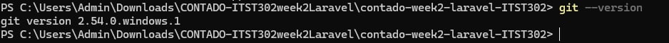
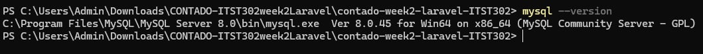
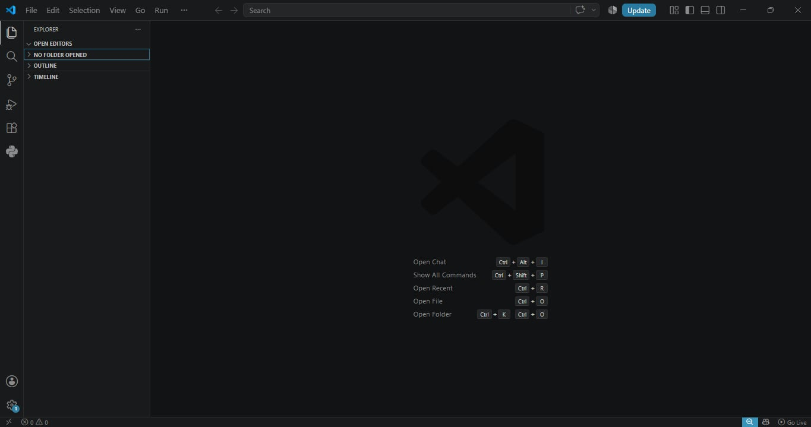
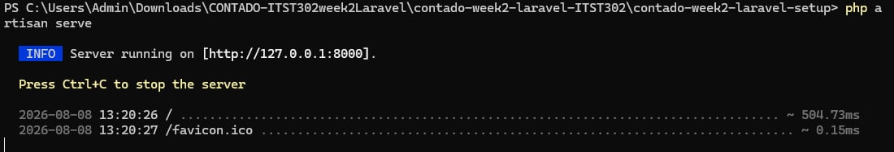
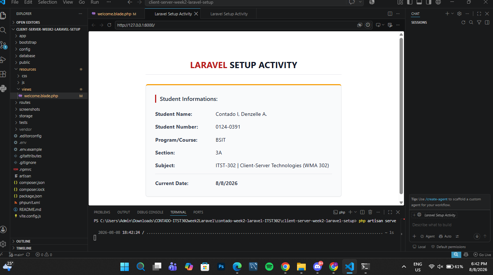
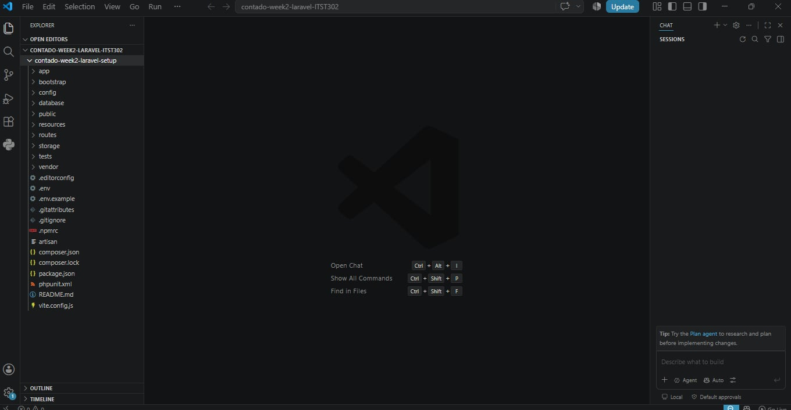

# ITST 302 — Professional Laravel Development Environment Setup

## 1. Project Title

**Hello Laravel — Client-Server Development Environment Setup**

**Subject:** ITST 302 — Client-Server Technologies  
**Project:** Mini Project 01: Professional Laravel Development Environment  
**Course:** Bachelor of Science in Information Technology (BSIT)  

---

## 2. Introduction

### Overview of Laravel
Laravel is an open-source PHP framework designed to streamline web development by using the Model-View-Controller (MVC) pattern. It handles complex backend operations—such as URL routing, database connections, and dynamic Blade template rendering—with clear, readable code. This framework allows developers to build maintainable, full-stack applications efficiently without building core server infrastructure from scratch.

### Importance of Client-Server Technologies
Client-server architecture is essential to modern web applications because it separates user interface components from backend processing logic. In this setup, the client browser issues HTTP requests over a network, and the server processes the request, manages database entries, and sends back the appropriate web view. Setting up a local web server and database environment provides practical experience with the mechanics of distributed software systems used in professional settings.

### Purpose of the Project
Prepared as part of the ITST 302 Client-Server Technologies course, this setup activity focuses on building and verifying a complete local development environment for the client-server-week02-laravel-setup project. The main goal is to assemble a functional stack including PHP 8.4, Composer, the global Laravel CLI, MySQL, and Git. The overall workflow involves initializing a new Laravel project, hosting it on the local Artisan server, updating resources/views/welcome.blade.php to present customized student information, and documenting each stage across a public GitHub repository.

---

## 3. Objectives

The following learning objectives were achieved upon completion of this activity:

1. Installed and configured PHP 8.4.21 as the core server-side scripting environment.
2. Verified Composer 2.9.5 as the global dependency manager for PHP packages.
3. Installed and verified the Laravel CLI installer globally.
4. Installed, configured, and verified MySQL Server 8.0.45 for database management.
5. Configured Git 2.54.0 version control and established proper commit conventions.
6. Initialized and opened the project inside Visual Studio Code v1.132.0 as the primary IDE.
7. Generated a clean Laravel project (`client-server-week02-laravel-setup`) using Composer.
8. Initiated the application locally using the `php artisan serve` development server.
9. Customized the default Blade view (`welcome.blade.php`) with dynamic metadata and styling.
10. Maintained structured version control with a minimum of 5 meaningful Git commits.

---

## 4. Development Environment

The local setup was built and verified using the following technologies:

| Tool / Component | Version |
| :--- | :--- |
| Operating System | Windows 11 |
| PHP | 8.4.21 |
| Laravel Installer | 5.25.1 |
| Composer | 2.9.5 |
| Git | 2.54.0.windows.1 |
| MySQL | 8.0.45 |
| Visual Studio Code | 1.132.0 |

### PHP Environment
PHP 8.4.21 serves as the server-side runtime for executing backend logic, running CLI tasks, and processing Artisan commands.

### Composer
Composer 2.9.5 serves as the dependency manager, managing global PHP binaries and project package installations.

### Laravel
The application utilizes Laravel Framework (initialized via Laravel Installer 5.25.1) to route incoming requests and serve dynamic Blade views.

### Git & GitHub
Git 2.54.0.windows.1 was configured for version control to track project iterations and publish the repository publicly to GitHub.

### MySQL Database
MySQL Community Server 8.0.45 was configured alongside system PATH variables to provide relational database capabilities.

---

## 5. Installation & Verification Steps

### Step 1 — Verify PHP Version
The PHP CLI runtime was verified in PowerShell:

```powershell
php -v
```

This confirmed that PHP 8.4.21 was active and properly recognized in the system terminal.

  
*Figure 1. Verification of PHP 8.4.21 installation.*

---

### Step 2 — Verify Composer Installation
Composer was verified using:

```PowerShell
composer -v
```

This output confirmed Composer version 2.9.5 was operating on top of the PHP runtime.

  
*Figure 2. Verification of Composer dependency manager.*

---

### Step 3 — Verify Laravel Installer
The global Laravel CLI tool was verified using:

```powershell
laravel -V
```

This confirmed Laravel Installer 5.25.1 was installed and ready to scaffold new applications.

  
*Figure 3. Verification of global Laravel CLI.*

---

### Step 4 — Verify Git Version Control
Git installation and system identity were verified using:

```powershell
git --version
```

  
This confirmed Git version 2.54.0.windows.1 was active and ready for source code management.
*Figure 4. Verification of Git version control system.*

---

### Step 5 — Verify MySQL Server
MySQL binary availability was verified in the terminal using:

```powershell
mysql --version
```

This confirmed MySQL Community Server 8.0.45 was properly bound to the system PATH.

  
*Figure 5. Verification of MySQL database server.*

---

### Step 6 — Verify Visual Studio Code Setup
The project workspace was opened inside Visual Studio Code to verify folder structures and editor extensions.

  
*Figure 6. Workspace structure opened inside VS Code.*

---

### Step 7 — Create the Laravel Project
A fresh Laravel project named `contado-week2-laravel-setup` was initialized using Composer:

```PowerShell
composer create-project laravel/laravel contado-week2-laravel-setup
```

This successfully generated the base application structure and installed required dependencies.

---

### Step 8 — Start Development Server
The local development server was started using Artisan:

```powershell
php artisan serve
```

The application started listening on http://127.0.0.1:8000.

  
*Figure 7. Laravel Artisan development server running.*

---

### Step 9 — Customize Application Homepage
The landing page was customized by modifying `resources/views/welcome.blade.php`. Custom CSS and dynamic Carbon date formatting were included to present student ( Contado I, Denzelle A..) metadata cleanly.

  
*Figure 8. Customized Laravel application homepage page.*

---

## 6. Command Reference & Summary

### Essential Terminal Commands

Below is a quick reference table of the core commands executed during the environment verification and project setup process:

| Tool / Framework | Command | Primary Purpose |
| :--- | :--- | :--- |
| **PHP** | `php -v` | Verifies active CLI runtime and version |
| **Composer** | `composer -v` | Verifies Composer dependency manager installation |
| **Laravel CLI** | `laravel -v` | Checks global Laravel installer tool |
| **Git** | `git --version` | Confirms Git version control system availability |
| **MySQL** | `mysql --version` | Validates MySQL server system PATH binding |
| **Composer Scaffolding** | `composer create-project laravel/laravel <project-name>` | Initializes a fresh Laravel project workspace |
| **Laravel Artisan** | `php artisan serve` | Starts the local HTTP development server (`http://127.0.0.1:8000`) |

---

### Key Technical Takeaways

* **Environment Pre-checks:** Validating individual runtime binaries (`php`, `composer`, `mysql`) before project creation prevents version mismatches and missing path errors during package resolution.
* **Artisan Serve Lifecycle:** Running `php artisan serve` initiates PHP's built-in web server to route web traffic directly to the `public/index.php` entry point.
* **Blade Templating Flexibility:** Modifying `resources/views/welcome.blade.php` enables custom front-end presentation using Tailwind CSS utilities while leveraging Laravel's dynamic view rendering.

---

## 7 - 8. Troubleshooting & Faced Issues

During the environment setup process, the following technical issue was encountered and subsequently resolved:

### Issue 1: MySQL Command Not Recognized (PATH Error)
**Problem:** 
When attempting to verify the MySQL installation using the `mysql --version` command, PowerShell returned a "CommandNotFoundException" error, stating that `mysql` was not recognized as the name of a cmdlet, function, script file, or operable program.

**Cause:** 
The MySQL binary folder was not automatically appended to the Windows System Environment `PATH` variable during the initial software installation. As a result, the terminal could not locate the `mysql.exe` executable file when the command was called globally.

**Solution:**
1. **Locate the Binary:** Navigated through the file explorer to find the exact MySQL `bin` directory path. Based on the installation, this was located at `C:\Program Files\MySQL\MySQL Server 8.0\bin`.
2. **Access Environment Variables:** Pressed the Windows key, typed "Edit the system environment variables," and pressed Enter.
3. **Edit System Path:** In the System Properties window, clicked the **Environment Variables...** button. Under the "System variables" section, scrolled down to select the **Path** variable and clicked **Edit**.
4. **Add the Path:** Clicked **New** and pasted the exact directory path (`C:\Program Files\MySQL\MySQL Server 8.0\bin`). Clicked **OK** on all three windows to save the configuration.
5. **Restart Terminal:** Completely closed Visual Studio Code and all active PowerShell windows. Reopened the terminal to force the system to load the newly updated environment variables.
6. **Verify Resolution:** Executed `mysql --version` once more, which successfully returned the active MySQL version details without error.

---

### Issue 2: Composer Project Creation Fails (Missing PHP Extensions)
**Problem:** 
When executing the `composer create-project laravel/laravel` command, the terminal throws a red error stating that a requested PHP extension (such as `ext-zip`, `ext-fileinfo`, or `ext-mbstring`) is missing from the system.

**Cause:** 
By default, standard PHP installations on Windows have several extensions disabled in the configuration file to improve security and performance. Composer requires some of these to unpack and read downloaded package archives.

**Solution:**
1. **Locate Configuration File:** Navigate to the main PHP installation directory and locate the `php.ini` file (if only `php.ini-development` exists, copy and rename it to `php.ini`).
2. **Edit the File:** Open `php.ini` in Visual Studio Code or Notepad.
3. **Enable Extensions:** Press `Ctrl + F` to search for the required extensions (e.g., `;extension=zip`, `;extension=fileinfo`). 
4. **Uncomment:** Remove the semicolon (`;`) at the very beginning of the line to enable the extension (it should now look like `extension=zip`).
5. **Save and Retry:** Save the file, restart the terminal to reload the PHP configuration, and re-run the Composer command.

---

### Issue 3: Artisan Serve Fails (Port 8000 Already in Use)
**Problem:** 
Running `php artisan serve` results in a connection error, or the terminal displays a message indicating that it cannot bind to `127.0.0.1:8000` because the socket is already in use.

**Cause:** 
Another application on the system (such as Skype, a different local server like XAMPP, or an orphaned, background PHP process from a previously closed terminal) is already occupying network port 8000.

**Solution:**
* **Option A (Change Port):** Instruct Artisan to serve the application on an alternate port by appending the `--port` flag:
  ```powershell
  php artisan serve --port=8080
  ```

---

## 9. Screenshots Summary

| Screenshot Asset | Visual Preview | Description |
| :--- | :---: | :--- |
| **PHP Version** |  | Verifies PHP 8.4.21 CLI installation in PowerShell. |
| **Composer Version** |  | Displays Composer 2.9.5 package manager setup. |
| **Laravel Version** |  | Displays global Laravel Installer version 5.25.1. |
| **Git Version** |  | Verifies Git 2.54.0.windows.1 version control environment. |
| **MySQL Version** |  | Confirms MySQL Community Server 8.0.45 installation. |
| **VS Code Setup** |  | Shows the project workspace structure opened in Visual Studio Code. |
| **Project Structure** |  | Displays the generated `contado-week2-laravel-setup` project directory. |
| **Artisan Serve** |  | Demonstrates `php artisan serve` running and listening on port 8000. |
| **Homepage** |  | Displays the final customized Laravel homepage view for my project |

---

## 10. Reflection


### What did you learn?

Throughout this project, I gained a comprehensive understanding of how to set up and configure a professional full-stack development environment from scratch. Specifically, I learned how to install and verify essential tools like PHP, Composer, Git, and MySQL server using the PowerShell terminal. I also learned how to use the global Laravel installer to scaffold a brand-new project workspace, manage dependencies, and launch a local web server using Laravel Artisan (php artisan serve). Additionally, customizing the default welcome view helped me understand how Laravel handles front-end presentation and routing.

### What challenges did you encounter?

The primary challenge I faced during the setup process involved system path configurations, specifically with MySQL. When running the `mysql --version` command, PowerShell threw a path error because the system did not automatically recognize the MySQL executable binary. I had search up the solution and to manually access the Windows Environment Variables, locate the MySQL bin directory path (C:\Program Files\MySQL\MySQL Server 8.0\bin), and update the system PATH variable. Encountering and resolving issues like command-not-found errors, execution policies, and missing application keys taught me the importance of careful configuration management and systematic troubleshooting.

### Why is Laravel important in client-server development?

Laravel plays a crucial role in modern client-server development by providing a powerful, elegant syntax and a robust MVC (Model-View-Controller) architecture. Instead of building every backend feature such as routing, security token management, and database connections from scratch, Laravel provides these tools out of the box. This standardization allows developers to focus on building unique application logic while ensuring that the client-side interface and server-side logic communicate securely and efficiently.

### How will this knowledge help you in future software development projects?

The foundational skills acquired during this setup will serve as a reliable blueprint and experience for all my future web development projects. Knowing how to properly configure a local server environment, manage package dependencies with Composer, utilize Git for version control, and troubleshoot common runtime errors will drastically reduce setup time. Furthermore, mastering Laravel's environment structure gives me a strong head start in building secure, dynamic, and scalable database-driven web applications as I continue advancing in my information technology studies.

---

## 11. References 

* Composer. (n.d.). *Composer documentation*. https://getcomposer.org/doc/
* Git. (n.d.). *Git documentation*. https://git-scm.com/doc
* Laravel. (n.d.). *Laravel documentation*. https://laravel.com/docs
* Oracle. (n.d.). *MySQL 8.0 reference manual*. https://dev.mysql.com/doc/refman/8.0/en/
* PHP Group. (n.d.). *PHP documentation*. https://www.php.net/docs.php